# AISL 2025

## What is this?

- A framework for synthesizing medical conversations based on EHRs
- An agent take place as doctor and another as the patient
- The doctor's reasoing and answer will be backed by medical articles/papers and local regulation
- The patient's question and answer is backed by EHR
- Types of scenario: QA based on EHR, Diagnosis
- Doctor maybe multi-agent

